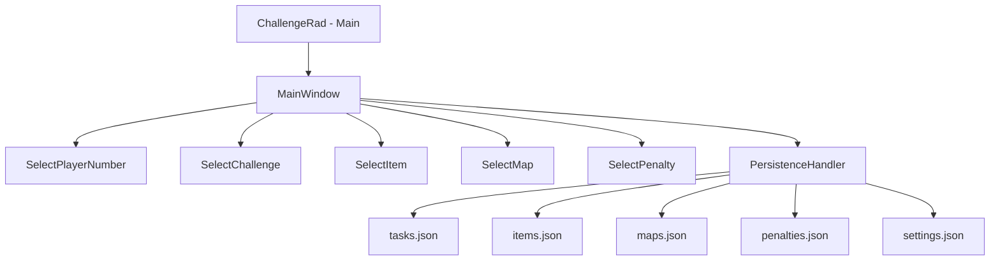
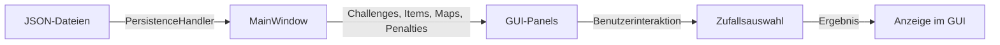

# Phasmo-Challenge-Generator

## Übersicht

Desktop-Anwendung zur zufälligen Auswahl von Challenges für das Spiel Phasmophobia. Die Anwendung bietet ein Challenge-Wheel mit Animation, einen Map-Randomizer, ein Item-Auswahl-System mit Timer sowie ein Penalty-System bei fehlgeschlagenen Challenges. Die Challenges werden aus JSON-Dateien geladen und können an die eigene Spielergruppe angepasst werden.

## Projektstatus

| Feld | Wert |
|------|------|
| Status | Aktiv |
| Stabilität | Stabil |
| Produktiv nutzbar | Ja |
| Letzte bekannte Änderung | Noch nicht dokumentiert |
| Offene Hauptaufgaben | Noch nicht dokumentiert |

## Metadaten

| Feld | Wert |
|------|------|
| Projektname | `Phasmo-Challenge-Generator` |
| Repository-URL | https://github.com/Canoobi/Phasmo-Challenge-Generator |
| Version | 1.5 |
| Lizenz | MIT |

## Technologie-Stack

| Bereich | Technologie | Zweck |
|---------|-------------|-------|
| Sprache | Java 22 | Anwendungslogik |
| GUI | Java Swing | Benutzeroberfläche |
| Build-System | Maven | Dependency-Management und Build |
| JSON-Verarbeitung | json-simple 1.1.1 | Laden von Challenges, Items, Maps, Penalties und Einstellungen |
| Packaging | Launch4j (Maven-Plugin) | Erstellung einer nativen Windows-.exe aus dem JAR |
| Installer | WiX / go-msi | MSI-Installer-Erzeugung |
| CI/CD | GitHub Actions | Automatischer Build und Release |

## Dependencies

| Dependency | Bereich | Zweck |
|------------|---------|-------|
| `json-simple` 1.1.1 | Backend | JSON-Parsing für Konfigurationsdateien |
| `maven-compiler-plugin` 3.13.0 | Build | Kompilierung mit Java 22 |
| `maven-shade-plugin` 3.2.4 | Build | Fat-JAR-Erstellung mit eingebetteten Dependencies |
| `launch4j-maven-plugin` 2.5.1 | Build | Erstellung der Windows-.exe |

## Projektstruktur

```text
Phasmo-Challenge-Generator/
├── src/main/
│   ├── java/com/files/
│   │   ├── ChallengeRad.java         # Main-Klasse (Einstiegspunkt)
│   │   ├── MainWindow.java           # Hauptfenster und GUI-Layout
│   │   ├── Challenge.java            # Challenge-Datenmodell (Record)
│   │   ├── Item.java                 # Item-Datenmodell
│   │   ├── Map.java                  # Map-Datenmodell
│   │   ├── Penalty.java              # Penalty-Datenmodell
│   │   ├── PersistenceHandler.java   # JSON-Datei-Laden
│   │   ├── SelectChallenge.java      # Challenge-Wheel-Logik und GUI
│   │   ├── SelectItem.java           # Item-Auswahl mit Timer
│   │   ├── SelectMap.java            # Map-Randomizer
│   │   ├── SelectPenalty.java        # Penalty-Randomizer
│   │   └── SelectPlayerNumber.java   # Spieleranzahl-Auswahl
│   └── resources/
│       ├── tasks.json                 # Challenge-Definitionen
│       ├── items.json                 # Item-Definitionen mit Bildpfaden
│       ├── maps.json                  # Map-Definitionen
│       ├── penalties.json             # Penalty-Definitionen
│       ├── settings.json              # Anwendungskonfiguration
│       ├── icon.ico                   # Anwendungs-Icon (.exe)
│       ├── icon.png                   # Anwendungs-Icon (Fenster)
│       └── itemImages/                # Item-Bilder (PNG)
├── application/                       # Generierte .exe-Datei
├── .github/workflows/
│   ├── build.yml                      # Automatischer Build bei Push
│   └── create-release.yml            # MSI-Release bei PR mit "RELEASE"
├── pom.xml                            # Maven-Konfiguration
├── wix.json                           # WiX-Installer-Konfiguration
├── LICENSE                            # MIT-Lizenz
└── README.md
```

## Architektur

| Komponente | Aufgabe | Technologie |
|------------|---------|-------------|
| MainWindow | Hauptfenster, GUI-Layout, State-Management | Java Swing (JFrame) |
| SelectPlayerNumber | Spieleranzahl-Auswahl | Java Swing (JPanel) |
| SelectChallenge | Challenge-Wheel mit Animation | Java Swing (Timer, JPanel) |
| SelectItem | Item-Randomizer mit Timer-Mechanik | Java Swing (Timer, JPanel) |
| SelectMap | Map-Randomizer | Java Swing (JPanel) |
| SelectPenalty | Penalty-Randomizer mit Key-System | Java Swing (JPanel) |
| PersistenceHandler | Laden aller JSON-Daten aus Resources | json-simple |



## Datenfluss



1. Beim Start lädt `PersistenceHandler` alle JSON-Dateien aus den Resources
2. `MainWindow` initialisiert alle GUI-Panels mit den geladenen Daten
3. Der Benutzer wählt die Spieleranzahl über `SelectPlayerNumber`
4. Der „Spin"-Button löst die Challenge-Auswahl aus (Animation mit Timer)
5. Die Challenge wird nach Spieleranzahl gefiltert und zufällig ausgewählt
6. Je nach Platzhaltern (`[$items$]`, `[$numb$]`, `[$color$]`) wird die Ausgabe angepasst
7. Parallel können Map, Penalty und Items über separate Panels ausgewählt werden

## Datenmodell

### Challenge (Record)

| Feld | Typ | Beschreibung |
|------|-----|--------------|
| `text` | String | Aufgabentext mit optionalen Platzhaltern |
| `openSelectItemFrame` | Boolean | Öffnet Item-Auswahl-Panel mit Timer |
| `message` | String | Alternative Ausgabenachricht (leer = text wird verwendet) |
| `reqPlayers` | int[] | Erlaubte Spieleranzahlen für diese Challenge |

### Item

| Feld | Typ | Beschreibung |
|------|-----|--------------|
| `name` | String | Item-Name |
| `itemType` | ItemType (STARTER/OPTIONAL) | Kategorie des Items |
| `imagePath` | String | Pfad zum Item-Bild in Resources |
| `message` | String | Optionale Nachricht |

### Map

| Feld | Typ | Beschreibung |
|------|-----|--------------|
| `name` | String | Map-Name |
| `size` | MapSize (small/medium/large) | Kartengröße |
| `message` | String | Optionale Nachricht |

### Penalty

| Feld | Typ | Beschreibung |
|------|-----|--------------|
| `name` | String | Penalty-Text |
| `message` | String | Alternative Ausgabe |

### Platzhalter in Challenges

| Platzhalter | Beschreibung |
|-------------|--------------|
| `[$items$]` | Fügt 2–12 zufällige Items mit Bildern an |
| `[$numb$]` | Fügt eine Zufallszahl zwischen 1 und 8 ein |
| `[$color$]` | Fügt eine zufällige Spielerfarbe ein |

### Platzhalter in Penalties

| Platzhalter | Beschreibung |
|-------------|--------------|
| `[$key$]` | Fügt eine zufällige Taste (W, A, S, D, Sprint, etc.) ein |

## Features

| Feature | Beschreibung | Status |
|---------|--------------|--------|
| Challenge-Wheel | Dreh-Animation mit zufälliger Challenge-Auswahl, gefiltert nach Spieleranzahl | Fertig |
| Item-Auswahl (Timer) | Timer-basierte Item-Zuweisung, jedes Item nur einmal wählbar | Fertig |
| Item-Auswahl (sofort) | Zufälliges Item ohne Timer auf der rechten Seite | Fertig |
| Map-Randomizer | Zufällige Kartenauswahl | Fertig |
| Penalty-Randomizer | Zufällige Bestrafung mit optionalem Key-System | Fertig |
| Spieleranzahl-Filter | Challenges werden nach gewählter Spieleranzahl gefiltert | Fertig |
| Platzhalter-System | Dynamische Texte mit `[$items$]`, `[$numb$]`, `[$color$]`, `[$key$]` | Fertig |
| Windows-.exe | Native Windows-Anwendung über Launch4j | Fertig |
| MSI-Installer | Automatische Installer-Erstellung über GitHub Actions | Fertig |

## API-Endpunkte

--

## Commands / CLI / Bot-Befehle

--

## Konfiguration

Die Anwendung wird vollständig über JSON-Dateien in `src/main/resources/` konfiguriert. Es gibt keine Umgebungsvariablen oder externe Konfigurationsdateien zur Laufzeit.

## Umgebungsvariablen

--

## Konfigurationsdateien

| Datei | Zweck | Muss angepasst werden |
|-------|-------|----------------------|
| `src/main/resources/settings.json` | Spieleranzahl, Timer, Farben, Tasten, Texte | Ja (bei eigener Version) |
| `src/main/resources/tasks.json` | Challenge-Definitionen | Ja (bei eigener Version) |
| `src/main/resources/items.json` | Items mit Bildpfaden | Nein |
| `src/main/resources/maps.json` | Verfügbare Maps | Nein |
| `src/main/resources/penalties.json` | Bestrafungen | Ja (bei eigener Version) |
| `pom.xml` | Maven-Build-Konfiguration | Nein |
| `wix.json` | WiX-Installer-Definition | Nein |

### settings.json

| Schlüssel | Typ | Beschreibung |
|-----------|-----|--------------|
| `start-message-1` | String | Initiale Nachricht (Spielerauswahl) |
| `start-message-2` | String | Nachricht nach Spielerauswahl |
| `challenge-message` | String | Überschrift bei Challenge-Ergebnis |
| `player-number` | String | Label für Spieleranzahl |
| `max-player-number` | Number | Maximale Spieleranzahl (Buttons) |
| `waiting-time-for-new-item` | Number | Timer in Sekunden für Item-Auswahl |
| `player-colors` | String[] | Verfügbare Spielerfarben |
| `keys` | String[] | Verfügbare Tasten für Penalty-System |

## Schnellstart

### Verwendung (Endbenutzer)

1. `.msi`-Datei vom letzten [Release](https://github.com/Canoobi/Phasmo-Challenge-Generator/releases) herunterladen
2. Java installiert haben (JDK 22 + JRE)
3. Installer ausführen
4. Anwendung starten und Spieleranzahl wählen
5. „Spin" klicken

### Eigene Version erstellen

1. Repository forken und klonen
2. JSON-Dateien in `src/main/resources/` anpassen
3. Änderungen pushen – die .exe wird automatisch gebaut

## Installation

### Voraussetzungen

- Java JDK 22: [Download](https://www.oracle.com/de/java/technologies/downloads/#jdk22-windows)
- Java JRE: [Download](https://javadl.oracle.com/webapps/download/AutoDL?BundleId=249550_4d245f941845490c91360409ecffb3b4)

### Umgebungsvariablen (System)

| Variable | Wert |
|----------|------|
| `JAVA_HOME` | Installationspfad des JDK (z.B. `C:\Program Files\Java\jdk-22`) |
| `PATH` | Installationspfad der JRE/bin (z.B. `C:\Program Files (x86)\Java\jre-1.8\bin`) |

## Lokale Entwicklung

1. Repository klonen
2. Projekt in IntelliJ IDEA öffnen
3. Maven-Dependencies laden lassen
4. `ChallengeRad.java` als Main-Klasse ausführen

## Build

| Befehl | Zweck |
|--------|-------|
| `mvn clean package` | Erstellt JAR und .exe im `application/`-Ordner |

Das Maven-Build führt automatisch folgende Schritte aus:

1. Kompilierung mit Java 22
2. Fat-JAR-Erstellung mit maven-shade-plugin (inkl. json-simple)
3. .exe-Erstellung mit launch4j-maven-plugin

## Tests

--

## Deployment

### Automatisch (CI/CD)

- Bei jedem Push: GitHub Action `build-exe-from-jar` baut die .exe und committet sie in `application/`
- Bei PR-Close mit „RELEASE" im Titel: GitHub Action `create-release-with-msi-installer` erstellt einen MSI-Installer und lädt ihn als Draft-Release hoch

### Manuell

```bash
mvn clean package
```

Die .exe wird in `application/PhasmoChallengeGenerator.exe` erzeugt.

## CI/CD

| Workflow | Trigger | Aktion |
|----------|---------|--------|
| `build.yml` | Push (alle Branches) | Maven-Build, .exe erstellen und committen |
| `create-release.yml` | PR closed (Titel enthält „RELEASE") | MSI-Installer erstellen, als Draft-Release hochladen |

## Sicherheit

--

## Logging / Monitoring

Die Anwendung gibt Debug-Informationen über `System.out.println` auf der Konsole aus (Challenge-Liste, Item-Liste, Maps, Penalties). Es gibt kein strukturiertes Logging-Framework.

## Fehlerbehandlung

- JSON-Parse-Fehler werden über `try-catch` abgefangen und über `e.printStackTrace()` auf der Konsole ausgegeben
- Bei fehlerhaften JSON-Dateien werden leere Arrays zurückgegeben
- Es gibt keine Benutzer-Fehlermeldungen im GUI

## Bekannte Limitierungen / Offene Punkte

- Nur für Windows nutzbar (Launch4j erzeugt .exe, MSI-Installer)
- Java-Installation (JDK 22 + JRE) als Voraussetzung notwendig
- Keine Tests vorhanden
- Kein strukturiertes Logging
- Fehlerbehandlung zeigt keine Benutzer-Fehlermeldungen im GUI
- Item-Bilder sind fest in Resources eingebettet und nicht extern konfigurierbar

## Wartung und Erweiterung

- Neue Challenges: Einträge in `src/main/resources/tasks.json` hinzufügen
- Neue Items: Einträge in `src/main/resources/items.json` hinzufügen, Bild in `src/main/resources/itemImages/` ablegen
- Neue Maps: Einträge in `src/main/resources/maps.json` hinzufügen
- Neue Penalties: Einträge in `src/main/resources/penalties.json` hinzufügen
- Einstellungen anpassen: `src/main/resources/settings.json` bearbeiten

### JSON-Format für Challenges

```json
{
  "text": "Aufgabentext",
  "openSelectItemFrame": false,
  "message": "Optionale Ausgabenachricht",
  "reqPlayers": [1, 2, 3, 4]
}
```

Verfügbare Platzhalter im Text: `[$items$]`, `[$numb$]`, `[$color$]`

## NPM-Scripts / Build-Befehle

| Befehl | Zweck |
|--------|-------|
| `mvn clean package` | Kompiliert, erstellt Fat-JAR und .exe |
| `mvn clean` | Bereinigt Build-Artefakte |

## Mitwirkende

- [blnpurple](https://github.com/blnpurple) – Challenges
- [Canoob](https://github.com/canoobi) – Challenge Generator

## Änderungsverlauf der Dokumentation

| Datum | Änderung |
|-------|----------|
| 2025-07-15 | Dokumentation vollständig neu erstellt nach verbindlicher Struktur |
